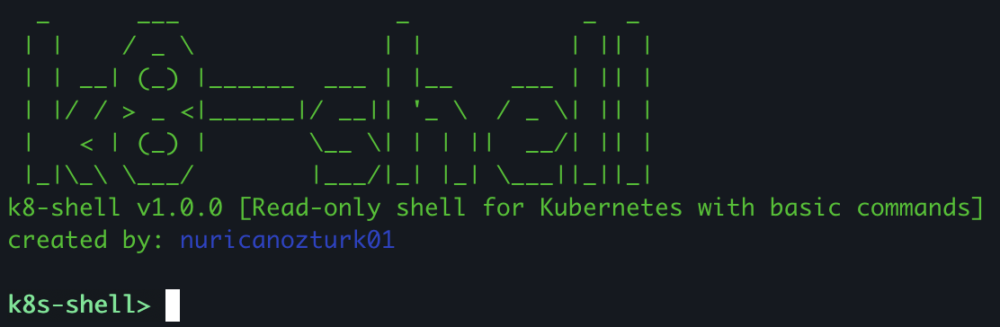
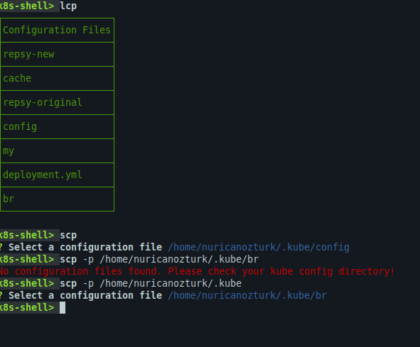
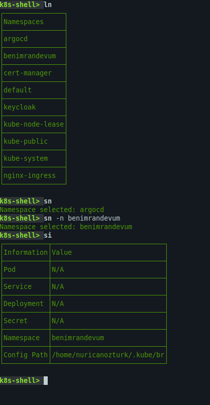
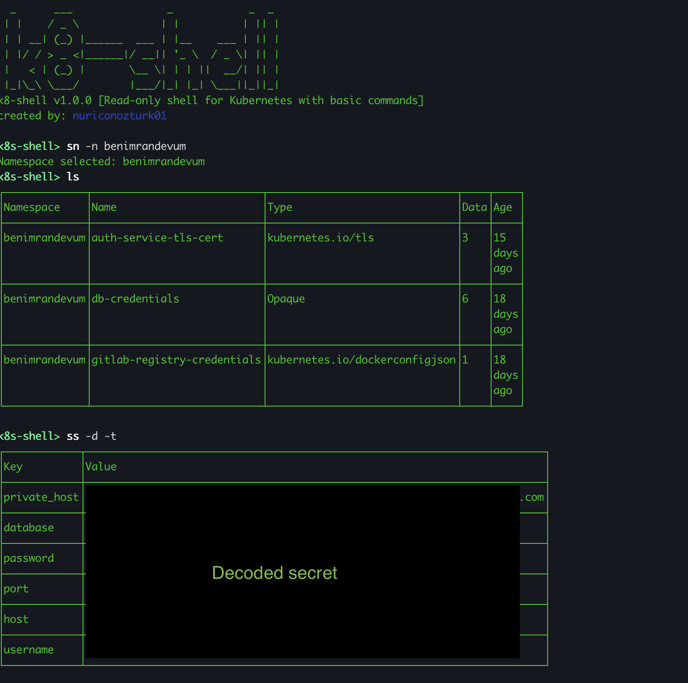

# k8-shell



k8-shell is a simple **read-only** shell script that allows you to interact with your Kubernetes cluster using a
shell-like interface.

- **_It is written to easily access the Kubernetes information I need. Suitable for personal use._**
- **If you are using Windows, you can use the *`WSL2 with ubuntu`* and select configuration path using `sc -p <path>`
  like
  `sc -p /mnt/c/nuri/.kube`**

## Installation

- Clone the repository
- Extract package application using `mvn package -Pnative -DskipTests`
    - Also, you can create native image using GraalVM.
- Run the java application in the target directory

## Images




## Commands
```bash
k8s-shell> help
```
```
AVAILABLE COMMANDS

Built-In Commands
       help: Display help about available commands
       stacktrace: Display the full stacktrace of the last error.
       clear: Clear the shell screen.
       quit, exit: Exit the shell.
       completion zsh: Generate zsh completion script
       completion bash: Generate bash completion script
       history: Display or save the history of previously run commands
       version: Show version info
       script: Read and execute commands from a file.

Configuration File
       scp, select config: Change the current configuration file in .kube directory
       lcp, list config: Show available configuration files in .kube directory

Kubernetes Commands
       lp, list pods: List all pods in the current namespace
       sp, select pod: Select a specific pod to view details

Kubernetes Deployment Commands
       sd, select deployment: Select a specific deployment
       ld, list deployments: List all deployments in the current namespace

Kubernetes Secret Commands
       ss, select secret: Select a specific secret to view or modify
       ls, list secrets: List all secrets in the current namespace

Kubernetes Service Commands
       ssv, select service: Select a specific service to view details
       lsv, list services: List all services in the current namespace

Namespace Commands
       ln, list namespaces: List all available namespaces
       sn, select namespace: Switch to a different namespace

Store Kubernetes Information
       show info, si: Prints Kubernetes information
       q: Exit application
       clear config path, ccp: Clears config path information
       clear deployment, cd: Clears deployment information
       clear info, ci: Clears Kubernetes information
       clear pod, cp: Clears pod information
       clear service, cse: Clears service information
       clear namespace, cn: Clears namespace information
       clear secret, cs: Clears secret information
```
- You can see the available options using `<cmd> -h` or `<cmd> --help` like `select secret -h
```bash
k8s-shell> select secret --help
```
- OR
```bash
k8s-shell> ss -h
```

```
NAME
       ss - Select a specific secret to view or modify

SYNOPSIS
       ss --decode boolean --show-table boolean --show-text boolean --memory boolean --help

OPTIONS
       --decode or -d boolean
       Decode base64 encoded data
       [Optional, default = false]

       --show-table or -t boolean
       List decoded secrets in a table format
       [Optional, default = false]

       --show-text or -s boolean
       List decoded secrets as plain text
       [Optional, default = false]

       --memory or -m boolean
       Use the memorized secret object from memory
       [Optional, default = false]

       --help or -h
       help for ss
       [Optional]


ALSO KNOWN AS
       select secret
```

