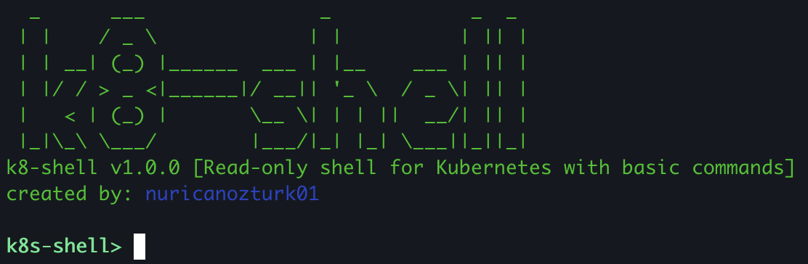
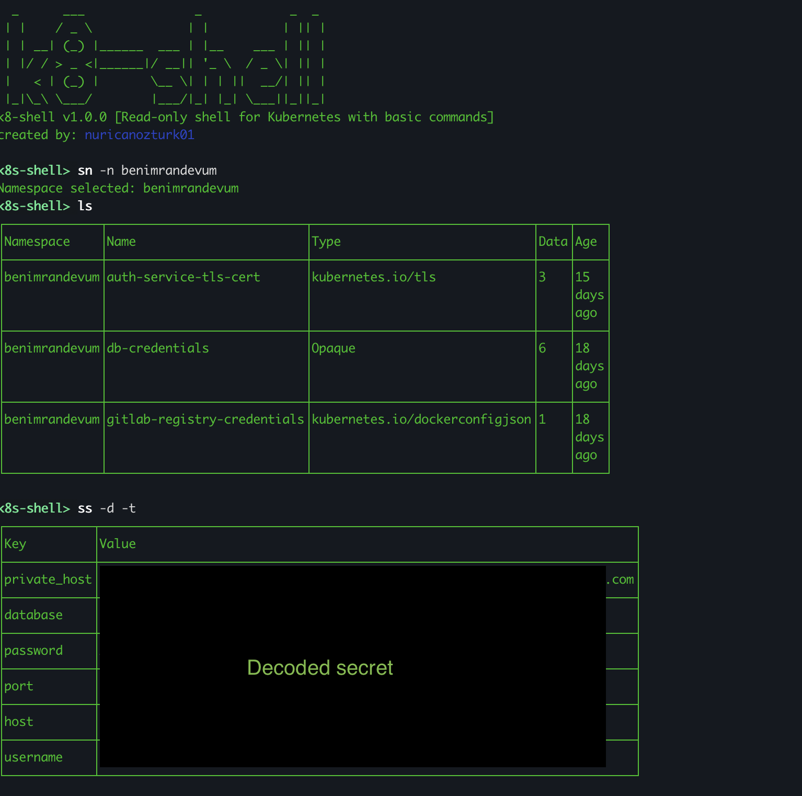

# k8-shell


k8-shell is a simple **read-only** shell script that allows you to interact with your Kubernetes cluster using a
shell-like interface.

## Installation

- Clone the repository
- Extract package application using `mvn package -Pnative -DskipTests`
    - Also, you can create native image using GraalVM.
- Run the java application in the target directory

## Video
https://github.com/user-attachments/assets/cc2d3e51-b8ba-4c67-a0c4-5de640ddf16e
## Images
- 

## Commands
```bash
k8s-shell> help
AVAILABLE COMMANDS

Built-In Commands
       help: Display help about available commands
       stacktrace: Display the full stacktrace of the last error.
       clear: Clear the shell screen.
       quit, exit: Exit the shell.
       completion bash: Generate bash completion script
       completion zsh: Generate zsh completion script
       history: Display or save the history of previously run commands
       version: Show version info
       script: Read and execute commands from a file.

Configuration File
       sc, set-config: Change the configuration file
       list config, lc: Show the current configuration files in .kube directory

Kubernetes Commands
       list pods, lp, list-pods: List some pods
       select pod, sp: Select a pod

Kubernetes Deployment Commands
       sd, select deployment: Select a deployment
       list deployments, ld: List deployments in the current namespace

Kubernetes Secret Commands
       ss, select secret: Select a secret
       list secrets, ls: List secrets in the current namespace

Kubernetes Service Commands
       sss, select service: Select a service
       list services, lss: List services in the current namespace

Namespace Commands
       ln, list namespaces: List namespaces
       select namespaces, set-namespaces, sn: Change namespace

Store Kubernetes Information
       show info, si: Prints Kubernetes information
       q: Exit application
       clear config path, ccp: Clears config path information
       clear deployment, cd: Clears deployment information
       clear info, ci: Clears Kubernetes information
       clear pod, cp: Clears pod information
       clear service, cse: Clears service information
       clear namespace, cn: Clears namespace information
       clear secret, cs: Clears secret information
```
